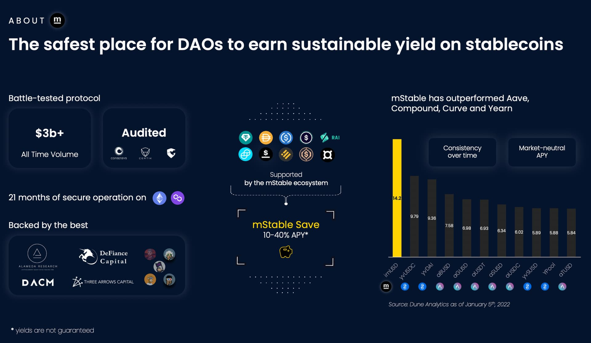
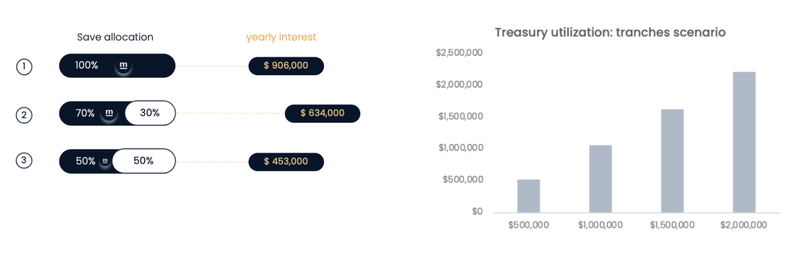

# KIP-22: Treasury Utilization Opportunity with mStable Save

```
kip: 22
title: Treasury Utilization Opportunity with mStable Save
author: loth.eth of mStable <theo@mstable.org>
status: submitted
tags: none
created: 2022-02-15
replaced-by: none
replaces: none
```

## Proposal

Invest a portion of the stablecoins in Rook DAO's treasury into mStable's Save product. 

## Background

Rook DAO and mStable DAO have been collaborating during the past weeks on a product partnership that would use a new version of Rook's magic MEV bots inside the mStable AMM. In parallel to this, Rook DAO Treasury was also brought into the discussion as mStable has a high-yielding savings account product that is relevant for Treasury utilization.

Both teams agreed that diversification of Rook's treasury into this product could be a part of a broader scheme of close collaboration between the mStable and Rook DAOs.

## Stablecoins and DAOs

We’re in the early days of DAO treasury management, driven by the fact that DAO treasuries have grown enormously in very little time, while tooling available to them remains fragmented, suboptimal and incomplete

Within this framework, we think it is sensible to expand the use of stablecoins within DAO treasuries. Stablecoins realize the value accrued within the treasury, secure the protocol OPEX and offer long-run stability against market cycles. Beyond that, they give the opportunity to create sources of non-operating income while enabling opportunistic investment behaviours that create value for the DAO (e.g. buying the dip, token buybacks, etc.).

## mStable and Stablecoin Utilization

Making stablecoins an integral part of a DAO’s diversification strategy will enable a path towards the DAO’s long-run sustainability, but it requires adequate tooling.

mStable is a decentralized stablecoin ecosystem producing sustainable yield on USD. The protocol has been operating for 22 months without interruption or hacks and is one of the safest projects in DeFi for stablecoins. mStable scored 93% on DefiSafety review as of March 17, 2022 [link](https://www.defisafety.com/pqrs?title=mstable). The project is backed by Three Arrows Capital, DACM, DeFiance Capital & Alameda Research among others.

As of the time of this proposal, Save APY was historically around 15%, significantly outperforming competition (Yearn, Aave or Curve). Please check this link for more granular and up to date historic performance details (Dune dashboard [here](https://dune.com/naddison/mStable-imUSD-returns)). 



## About Save strategy

mStable deposits 98% of mUSD’s underlying assets to established lending markets to earn a base interest rate. This rate is then further increased by distributing mStable Swap fees and liquidating external protocol incentives.

mUSD exposition is:

* 51% to Aave
* 49% to Compound

As of the time of this proposal, the Save APY can be broken down as follows: 55% of it is coming from lending interest revenues on Aave & Compound, 22.5% from our AMM swap fees & the remaining 22.5% from platform rewards liquidation. It would mean that 22.5% of Save yield is independent of lending protocol and their inherent risk. 

## Rook DAO opportunity with mStable

mStable Save is a stablecoin-agnostic savings platform for DAOs. Looking closely at Rook's treasury, we think such a utilization move could make sense. Considering the existing healthy structure of the treasury given its significant holdings of stablecoins, and the re-collateralization backstop protecting the $ROOK token, the protocol could explore moving a significant part of its available stablecoins

## Rationale & Scenario analysis

According to an October blog [post](https://blog.rook.fi/financial-update-october-2021/), Rook DAO's yearly burn rate was $740,499, which would take a $4.93m allocation at a 15% APY to cover it fully. Rook DAO could thus consider allocating between 50% and 80% of its unused USD holdings to cover (partially or fully) the DAO yearly expenses

To get started, we recommend that Rook's treasury deposit funds in tranches of $500,000 on a quarterly basis for a period of the community’s choosing. Using current data as of February 2022, this would result in an estimated annual yield of $210,595 if done for a full year. This would be an 11% marginal rate (Save proceeds are automatically compounded). 

Please find below: 

* A scenario analysis for deploying between 50% and 100% of Rook Stablecoin Treasury into Save with the corresponding yearly return based on February 2022 data
* The tranches version of same. 



## Benefits

With the aforementioned amount deposited into Save, Rook DAO could pay with mStable Save APY earnings a significant portfolio of its yearly capital requirement. 

More generally, benefits would be:

* Passive management of treasury
* Consistently strong APY
* Long-term protocol value growth
* Trustless contract
* Non-operating revenue stream
* Seamless treasury management

## Specification

Rook's treasury to deposit funds in tranches of $500,000 on a quarterly basis for a period of the community's choosing. 
