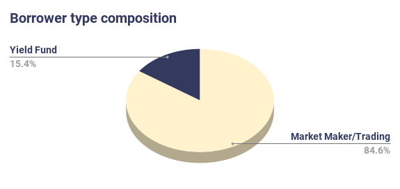
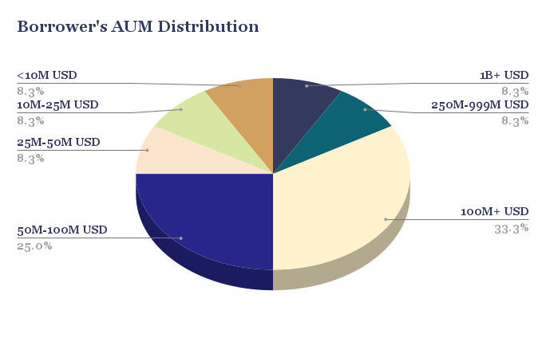
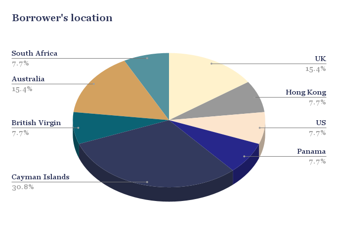
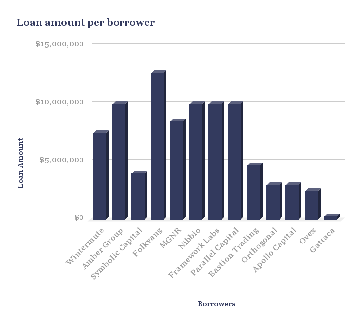
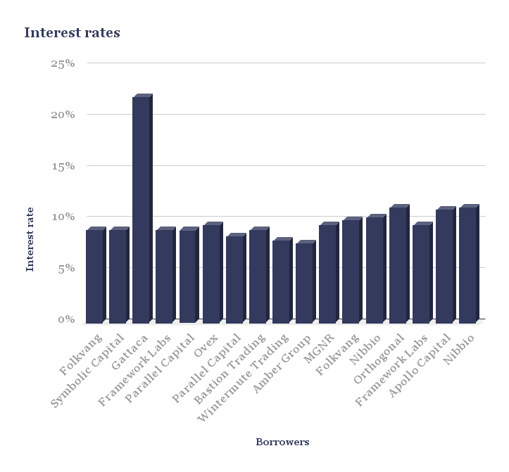
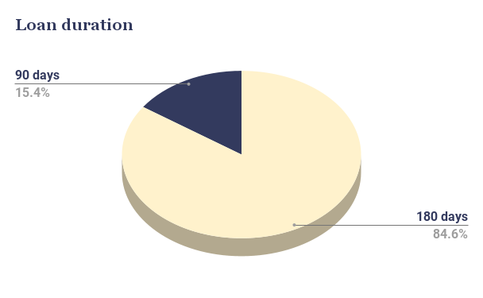
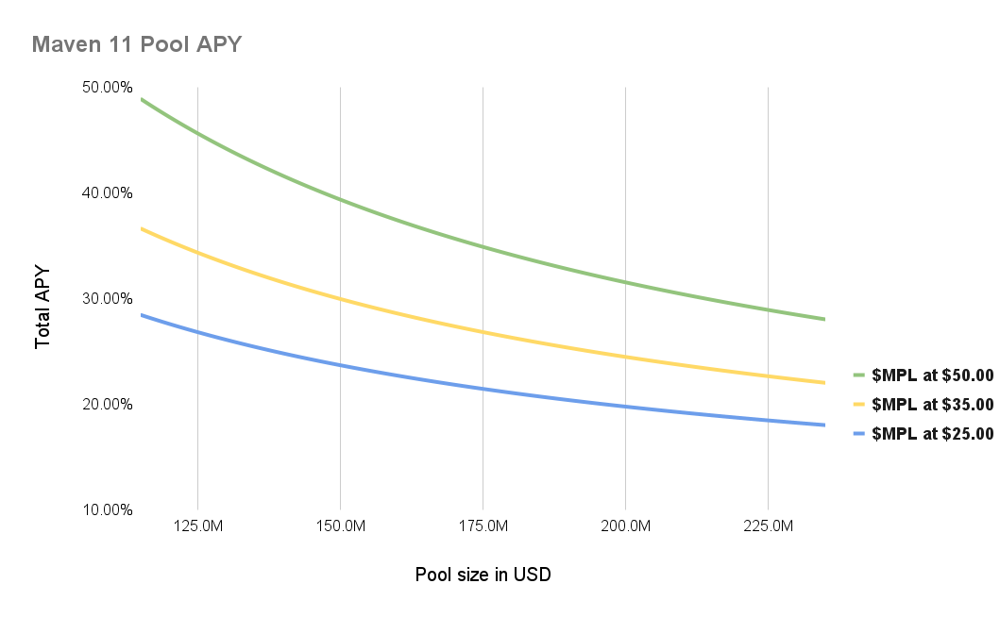

# KIP-6: Yield generation on Maple Finance

```
kip: 6
title: Yield generation on Maple Finance
author: Maven11
status: last-call
created: [2021-10-19]
```

## Introduction

The following documentation is a proposal to invest a portion of KeeperDAOs treasury funds into the **Maple Finance** protocol. Maple Finance is a decentralized corporate credit platform that allows KYC’d institutions to borrow funds on an undercollateralized basis. The protocol works with lending pools that are managed by Pool Delegates, who are asset managers (such as Blackrock in TradFi) with credit expertise that assess the borrower’s credit worthiness and set up the terms of the loans such as interest rate and collateral ratio. We, **Maven 11** , perform a role of a Pool Delegate and manage one of the two pools on Maple Finance. We are an Amsterdam based digital asset investment firm combining deep roots in the DeFi ecosystem with professional experience in finance. To strengthen our team and our credit capabilities, we in addition hired an external advisor who has over 10 years of experience in high-risk loan origination and credit risk management who currently manages a EUR 2B credit book in his TradFi job but equally has been a DeFi participant personally and shares our passion and conviction to the space. This addition to the team has been instrumental in understanding and pricing risk for our Maple Finance activities.

The numbers in the proposal were last updated on the 19th of October, so we cannot guarantee that they are up-to-date by the time of posting or reading. Also, for this proposal we’ve borrowed from a successful [proposal](https://forum.nexusmutual.io/t/investing-the-capital-pool-in-steth/510) on the Nexus Mutual governance forum.

**_AMA session_**

We invite you to read through the proposal and welcome any feedback, comments, suggestions and concerns. We are happy to schedule a **Maple x M11 AMA** with the KeeperDAO community in order to walk you through our origination and risk management practices and discuss the proposal more in depth. After conversation with the KeeperDAO team, we propose to discuss the following proposal on the **28th of October** .

## Rationale

**_Why Invest?_**

Currently, assets in the [KeeperDAO treasury](https://gnosis-safe.io/app/#/safes/0x9a67F1940164d0318612b497E8e6038f902a00a4/balances) are valued at approximately **$112 million** , of which some $30 million is kept in various forms of stablecoins. Of those **$30 million** , approximately $9 million is held in USDC (and $4.5 million is held in kUSDC).

The main purpose of utilizing a portion of stablecoins held by the KeeperDAO treasury to provide liquidity on Maple Finance is to **generate an additional yield on now-idle assets** . This will enhance the capital efficiency of the treasury, the value of which will ultimately find its way back to the members of the DAO.

We are aware that the risk appetite for the majority of DAOs is relatively low as the treasury assets, in particular stablecoins, are viewed as a buffer for potential adverse scenarios such as a bear market. We think that the lending opportunity in collaboration with Maven 11 Capital and Maple Finance as presented in this proposal is particularly suitable from a risk/reward perspective. This lending opportunity presents a solution that combines a relatively moderate risk profile while simultaneously offering a generous yield.

**Why Maple Finance?**

To reiterate, the lending opportunity presented in this proposal is for KeeperDAO to use (a part of) their treasury’s stablecoins to provide liquidity in the Maple Finance protocol. As mentioned previously, Maple Finance is a decentralized corporate credit platform where KYC’d institutions can borrow funds on an undercollateralized basis based on legally enforceable loan agreements. The protocol currently works with USDC lending pools that are semi-permissioned: liquidity provision is fully permissionless, i.e. any participant can freely deposit collateral, but borrowing is fully permissioned as ensured by a Pool Delegate (PD). These PDs are parties with credit and fund management expertise and act as asset managers for their pool. The PDs perform the activities required for the borrowing, i.e. identifying and reaching out to potential borrowers, assessing borrower’s credit worthiness, negotiating loan terms like interest rates and collateral ratios and monitoring of the exposure.

It is important to stress the strong incentive alignment between the PDs and the collective of depositors of the liquidity pool. PDs stake USDC/MPL governance token as a protection mechanism which would take full hits until fully wiped out in case of loan defaults, ensuring that the PD has skin in the game as well as LPs have a security buffer before their capital would be affected by a default in any form. The current pool cover amounts to 7,900,000 USDC which is largely provided by Maven 11. There are concrete plans to increase the pool cover through deposits from 3rd parties that are also stakeholders in the Maple Finance ecosystem soon.

The features outlined above that are unique to Maple Finance allow them to position themselves as the new go-to undercollateralized liquidity provider for institutional borrowers. Because of this, the protocol has attracted many well-known and highly reputable borrowers. The full list of previous borrowers, loan amounts and durations can be found [here](https://app.maple.finance/#/liquidity/60e3e70cd993f30012ceae40) at the bottom of the page, but the list is composed of Framework Labs, Amber Group, Folkvang, Nibbio, Orthogonal, Wintermute, MGNR, and more borrowers of similar reputation. For liquidity providers, Maple Finance and the Maven 11 pool grant access to such crypto-native, top-notch borrowers, which cannot be directly dealt with in an equally institutionalised and safeguarded process elsewhere.

**To summarize** , we think the lending opportunity presented here is appealing for the following reasons:

- The ability to generate an attractive yield on idle stablecoins in the treasury while diversifying treasury assets
- Participation in a lending & borrowing platform where highly reputable borrowers are sourced by a PD with relevant credit and risk management expertise.

## Statistics of Maven 11 pool

The following is a summary to provide some context on the performance of the [Maven 11 liquidity pool](https://app.maple.finance/#/liquidity/60e3e70cd993f30012ceae40).

- The Maven 11 liquidity pool has grown from $0 TVL to over **$115 million TVL** in 3 months.
- We have funded 19 loans thus far, at a total value of almost $90 million
- The pool has faced **0 defaults** .

The total composition of the pool consists of market making/trading companies as well as yield funds. All of our borrowers are considered as market neutral (i.e. they do not have directional exposure to the market).



The distribution of the borrowers in terms of their size is very wide and ranges from less than 10M USD to as large as 1B+ USD.



The geographical distribution of the borrowers is also very spreaded. As we can observe on the pie chart, almost 1/3rd of our borrowers are registered on the Cayman Islands while the rest is spreaded rather uniformly among other jurisdictions such as the US, Australia or UK.



The loan amount per borrower varies from as little as $250.000 to as much as $12.7 million. We are working hard to reduce the pool concentration with a target of maximum 10% of the pool size per borrower. We are close to achieving this goal, however it is worth noticing that in the early phase of the project, larger counterparties require relatively larger loans compared to the smaller participants. Once the pool size will grow substantially, the borrower base will follow, which will drastically reduce the exposure to a particular counterparty.



As we can observe on the following chart, the interest rates are hovering around the 10% mark (excl. Gattaca). Recently, we have seen an uptick in the rates across the market, therefore our borrowers are paying around 11% at the moment.



We started the pool with the loans set for 90 days to build a credit history with our borrowers and bootstrap the pool in a shielded manner. Currently, our loans in large majority have a tenor of 180 days. We are also exploring longer term (360 days) as well as super short term loans (30 days) to better fit into our borrowers’ needs.



For more statistics, please refer to the [Dune Analytics dashboard](https://dune.xyz/scottincrypto/Maple-Deposits) or to the [Maple Finance page ](http://app.maple.finance).

## Proposal

**_Amount and Duration of Investment_**

The proposal is for KeeperDAO to invest 3,500,000 USDC in the liquidity pool where Maven 11 is a Pool Delegate. This amount of USDC would represent 3.1% of the value of KeeperDAO treasury’s assets, or ~12% of the total stablecoin assets in KeeperDAOs treasury. Providing this amount of USDC to the liquidity pool would maintain risk at an appropriate level with negligible risk for the overall financial health of the DAO.

**_Parameters_**

Minimum amount of asset to be invested: 3,500,000 USDC

Minimum lock up period: 180 days

**_Rewards_**

Lenders receive 80% of the interest payments from the borrowers in USDC, while the remaining 20% is distributed in a 50:50 split to the Maple Finance treasury and the PD. On top of that, Maple Finance provides incentives to the lenders in their native governance token MPL which can be used for staking (i.e. providing capital of last resort in case of defaults) and for governance of the protocol and the treasury.

**To summarize** , depositing USDC in the Maven 11 liquidity pool on Maple Finance will generate two different flavors of yield: yield in USDC, and yield in the MPL governance token.

- USDC yield, which currently hovers around 10% APY. This yield is subject to a 90 day lock up.
- MPL reward token yield, which currently hovers around 25% APY. These reward tokens are released on a block by block basis.

This means that at time of writing, the total APY on USDC deposits is **roughly 35%** .

**_The APY itself is dependent on 3 factors:_**

1. **Interest rates** - when the interest rates among the borrowers in the pool are increasing, the USDC part of yield is increasing as well (and vice versa).
2. **Amount of liquidity in the pool** - when the pool increases in size, the rewards in MPL are decreasing proportionally as the number of MPL tokens needs to be distributed among a larger number of participants (and vice versa).
3. **MPL price** - when the price of MPL is increasing, the rewards in MPL are higher in $ terms, effectively increasing the APY (and vice versa).



- _The values are indicative up to 6th of January 2022. This chart takes into consideration 3 factors listed above, including different MPL price levels, and is based on the current MPL rewards rate. Note that these numbers used are purely for educational purposes to demonstrate the mechanism for MPL APY; they do not represent actual rates and should not be relied upon._

## Risks

**_Smart contract risk_**

Participating in DeFi protocol comes with an inherent risk of smart contract vulnerabilities and bugs. In the case of participation in Maple Finance, a few mitigating factors can be noted. Firstly, the contracts used by Maple Finance have been thoroughly audited by [Peckshield](https://drive.google.com/file/d/1NBJNJw9eUdQEs94lyREIzG9AtzgJ5FXy/view?usp=sharing), [Code Arena](https://code423n4.com/reports/2021-04-maple/) and [Dedaub](https://drive.google.com/file/d/1gK8MIssPJBFlGonU4dhrxp7kLPV2t8ZI/view?usp=sharing) (please refer to the Maple Finance [Github](https://github.com/maple-labs/maple-core) for more details). Secondly, the contacts are characterized by their relatively low complexity which leads to a low probability of exploits. Third, the utilization rate of funds in the liquidity pool is very high as PDs aim to keep as little cash as possible in the pool in order to consistently lend out the USDC to borrowers and provide yield to our LPs (of course, keeping in mind that proper risk management practices are in place). Therefore, the smart contracts of Maple Finance become highly unattractive targets for hackers as the potential reward is very small.

**_Default risk_**

As Maple Finance facilitates undercollateralized lending, the protocol faces an inherent risk of borrowers defaulting. To mitigate this, Maven 11 together with other protocol participants provide the capital of last resort for our pool. This capital is liquidated first when the default of the borrower occurs, therefore it should be treated as a “junior tranche”. As a result, LP capital - the “senior tranche” - is affected on a pro-rata basis if the junior tranche does not cover the loan amount in full. On top of that, the borrowers are facing legal consequences on their defaults. They are obliged to sign a [Master Loan Agreement ](https://docs.google.com/document/d/1yy0E9LwS4y4bpyJ9syM7oMgA01cJKNrB-x0PI5Pw_Tg/edit?usp=sharing)(enforceable by NYC law) as well as to go through the full [KYC ](https://drive.google.com/file/d/1ShpjSeYxEkUq63qIaR1Nmq8zT-BnWIWb/view?usp=sharing) process. Lastly, they are facing reputational risk, as a default on Maple Finance will likely translate into a complete drought of credit facilities for the borrower. It is relevant to note that the protocol has faced 0 defaults thus far.

**_MPL price risk_**

As mentioned previously, a portion of the yield generated on USDC deposits comes from MPL governance token rewards. This means that price appreciation of these tokens will lead to increased APYs, but naturally also means the same vice versa. The accumulation of these governance tokens will provide KeeperDAO with a stake in the Maple Finance project, but the value of these tokens is dependent on the growth and adoption of Maple Finance in the broadest sense.

**_Liquidity pool growth_** (decrease in APY)

As the liquidity pool grows in size, the liquidity incentivization through MPL governance tokens rewards will decrease proportionally as the total amount of MPL tokens emitted is distributed over a larger number of participants.

**_Market conditions_** (decrease in interest rates on stablecoins)

If market conditions were to deteriorate, a low volatility period where our target borrowers i.e. market makers are less profitable, it would be sensible to assume that the demand for leverage would also decrease. This could lead to a decrease in interest rates, and thus a decrease in the APY for depositors.

**Additional Risks and Considerations for KeeperDAO**

From a philosophical standpoint, the participation of KeeperDAO in a semi-permissioned decentralized corporate credit platform might be considered contentious by some. We would like to stress that liquidity provision to the Maple Finance platform is fully permissionless, and that only the borrowing is fully permissioned (requires KYC and MLA). In our opinion, a more appropriate framing of this concern is the following: any liquidity provider can now be connected with very reputable borrowers through the intermediary services offered by Maple Finance and the PDs, while facilitating undercollateralized lending, something that other DeFi platforms currently can not offer easily.

Here, the intermediary Pool Delegate role is critical in order to perform the due diligence on the borrowing companies. We are trying to take an individual approach with our borrowers that closely resembles an OTC experience. We believe that this approach allows us to gather the necessary information and details that are crucial for the risk assessment. We are convinced that at this moment, the role of the PD cannot be replaced by other mechanisms as the human factor has a leading role in the process. In the future, the number of PDs on Maple Finance will grow, therefore the lenders will have a much broader choice in terms of delegating their capital to the risk assessor they trust the most.

## Specification

The proposal outlined here is to be put through the KeeperDAO governance process in order for the community to be able to review the proposal and provide feedback where necessary. If the proposal is approved by the DAOs governance process, the implementation of the proposal should follow these steps:

**1.** On Maple Finance, approve USDC to spend
**2.** Deposit 3,500,000 USDC to the Maven 11 liquidity pool and receive Maple Pool Tokens (MPT), to be eligible for receiving USDC rewards
**3.** Approve MPT to spend
**4.** Stake MPT in Maple Finance, to be eligible for receiving MPL governance token rewards

## Additional links

[KeeperDAO treasury address](https://gnosis-safe.io/app/#/safes/0x9a67F1940164d0318612b497E8e6038f902a00a4/balances)

[Maple Finance app ](https://app.maple.finance/#/liquidity)

[Guide to lending on Maple ](https://maplefinance.ghost.io/lending/)

[Maple Finance Dune Dashboard](https://dune.xyz/scottincrypto/Maple-Deposits)

[Maple Finance AML KYC procedure ](https://drive.google.com/file/d/1ShpjSeYxEkUq63qIaR1Nmq8zT-BnWIWb/view?usp=sharing)

[Master Loan Agreement (MLA) ](https://docs.google.com/document/d/1yy0E9LwS4y4bpyJ9syM7oMgA01cJKNrB-x0PI5Pw_Tg/)

[Maple Finance API docs](https://maplefinance.gitbook.io/maple/api/public)

[Credit Memo ](https://docs.google.com/document/d/1LL2z9gIFpq4hT-PblyF_s4-GXGO_4tUVAc3oViE1rJE/edit?usp=sharing)
